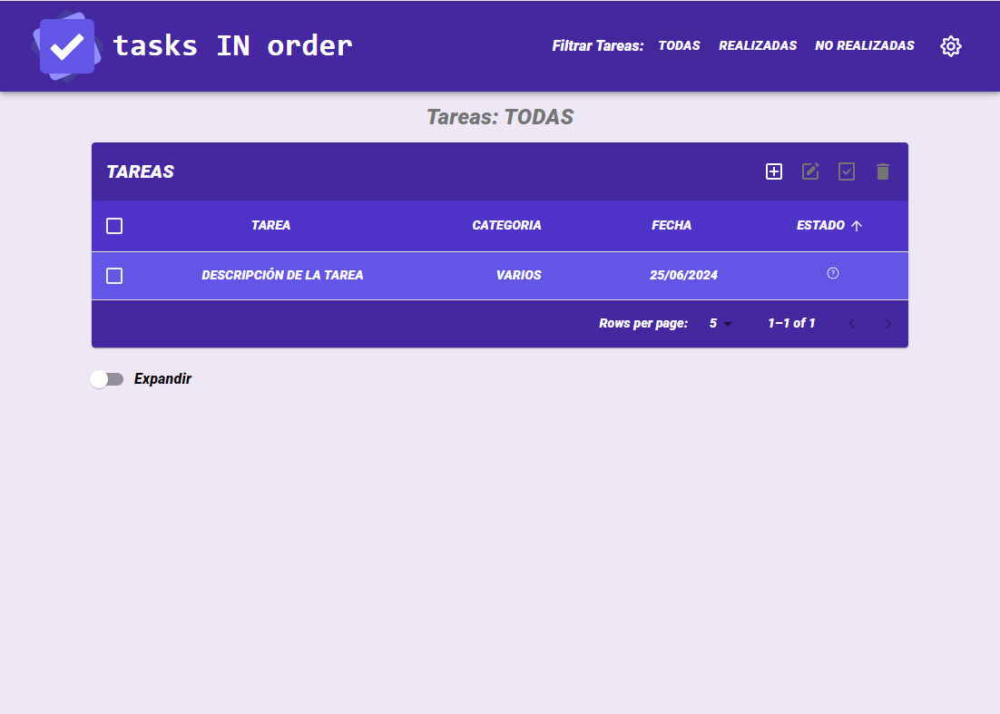
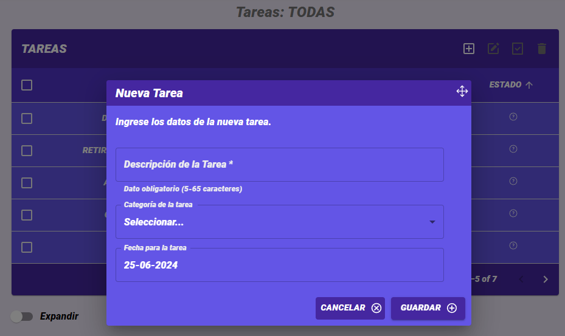

<!-- ===========================================================
                            PRESENTACIÓN
     =========================================================== -->

   

---

---

## Tabla de Contenidos:

- [tasks IN order](#tasks-in-order)

- [Tecnologías](#tecnologías)

- [Tareas](#tareas)

- [Móviles](#mobile)

- [Contáctame](#contáctame)

---

<!-- ==================================================
                         CONTENIDO
     ================================================== -->

## _tasks IN order_

[:top:](#tabla-de-contenidos)  

> Las aplicaciones web, comúnmente conocidas como apps, se han convertido en una parte esencial de nuestra vida cotidiana. Las apps se han consolidado como nuestras aliadas, simplificándonos tareas diarias complejas, como otras no tan complejas como por ejemplo el registro de tareas pendientes de realización.   `tasks IN order` se consolida como una herramienta sencilla y sumamente útil, ideal para registrar de manera fácil, tareas con su respectiva fecha de posible realización.

   

La aplicación `tasks IN order`, fue diseñada de tal manera que pueda ser utilizada en diferentes dispositivos, lo que implica un correcto diseño responsive.

   

 

`tasks IN order` es una app desarrollada como Trabajo Final del "Módulo 5 - React", de la capacitación de `"Desarrollo Frontend"` dictado por [ADA ITW](https://www.linkedin.com/school/ada-itw/), y se encuentra incluido en mi `Portfolio Personal`, de tal manera de reflejar el grado de avance, apropiación y uso de los conocimiento adquiridos y asimilados durante la capacitación.

> [!NOTE]
> Visite mi portafolio personal: [PORTFOLIO](https://maguibrollo.github.io/ADA_Portafolio_mod01_tf/).

 

---
## _Tecnologías_

[:top:](#tabla-de-contenidos)  
`tasks IN order` fue desarrollada utilizando las siguientes tecnologías:

|                                                     |                                                                                                   |
| :---------------------------------------------------------------------------------------------------------------------------------------------------------------------------: | :-----------------------------------------------------------------------------------------------------------------------------------------------------------------------------------------------------------------------------------: |
| React es una biblioteca Javascript de código abierto diseñada para crear interfaces de usuario con el objetivo de facilitar el desarrollo de aplicaciones en una sola página. | Material UI es una librería de componentes de React. js, de código abierto creada por Google, basada en Material Design, la cual brinda pautas y lineamientos que sientan la base para crear diseños profesionales para aplicaciones. |

 

---
## _Tareas_

[:top:](#tabla-de-contenidos)  
La pantalla principal de la aplicación presenta las siguientes opciones:

- [1) Menú Filtros](#1-menú-filtros)
- [2) Modo Claro Oscuro](#2-modo-claro-oscuro)
- [3) Nueva Tarea](#3-nueva-tarea)
- [4) Editar una Tarea](#4-editar-una-tarea)
- [5) Marcar Tareas Realizadas](#5-marcar-tareas-como-realizadas)
- [6) Borrar Tareas](#6-borrar-tareas)

   

---
### _1) Menú Filtros:_

[:top:](#tareas)  

Este menú permite filtrar las tareas por `Realizadas` o `No Realizadas`, también es posible volver a mostrar `Todas`. Al ingresar a la aplicación, por defecto siempre muestra todas las tareas.

   

 

> [!NOTE]
> Si la cantidad de tareas que existen, supera la cantidad de 5, en la parte inferior de la tabla de tareas, es posible seleccionar entre visualizar 5, 10 ó 20 tareas.
> Además, presenta la posibilidad de pasar de una página a la siguiente. Por último,a la izquierda de la ventana principal,  el selector de expandir o contraer la información de la tabla.

   

 

---
### _2) Modo Claro Oscuro:_

[:top:](#tareas)  

Esta opción del menú principal, permite intercambiar entre el `Modo Claro` con tonalidades de color púrpura, y el `Modo Oscuro` que presenta la aplicación en tonos de grises.

|                                      Modo Claro                                       |                                      Modo Oscuro                                       |
| :-----------------------------------------------------------------------------------: | :------------------------------------------------------------------------------------: |
|  |  |

 

---

### _3) Agregar una tarea:_

[:top:](#tareas)  

El icono de "Agregar una Tarea"  , se encuentra siempre activado, permitiendo agregar tareas en todo momento, aunque se aplique un filtro o se seleccionen tareas.  
Los datos obligatorios son:
- Descripción: un breve texto entre 5 a 65 caracteres que describa la tarea. Independientemente de cómo se escriba, siempre se visualizará en mayúsculas y sin acentos. 
- Categoría: seleccionar de la lista la categoría adecuada, en caso de no existir, seleccionar "Varios".
- Fecha: seleccionar del calendario, la fecha en que debería realizarse la tarea. 

   

---

### _4) Editar una Tarea:_

[:top:](#tareas)  

El icono de "Editar una tarea"  se activará únicamente cuando se seleccione UNA sola tarea. 
Los datos a completar son los mismos que en la opción de agregar una tarea.

   

---

### _5) Marcar como Tarea Realizada:_

[:top:](#tareas)  

El icono de "Marcar como Tarea Realizada" , se activa después de seleccionar por lo menos una tarea. Puede utilizarse este icono para MARCAR una tarea (o varias) como Realizada/No relaizada. En la columna "Estado" se visualizará un icono diferente dependiendo si la tarea esta marcada como Realizada  , no Realizada .

   

---

### _6) Eliminar Tareas:_

[:top:](#tareas)  

El icono de "Eliminar tarea/s seleccionada/s" , se activa después de seleccionar por lo menos una tarea. Puede utilizarse este icono para BORRAR una tarea o varias tareas juntas. 

   

---

## _Mobile_

[:top:](#tabla-de-contenidos)  
Todas las opciones antes descriptas, se encuentran disposnibles para los diferentes dispositivos móviles.

|                           Modo Claro                           |                           Modo Oscuro                           |
| :------------------------------------------------------------: | :-------------------------------------------------------------: |
|  |  |

 

|                           Nueva Tarea                           |                        Marcar Ralizadas                         |
| :-------------------------------------------------------------: | :-------------------------------------------------------------: |
|  |  |

---

## _Contáctame:_

[:top:](#tabla-de-contenidos)  

---

